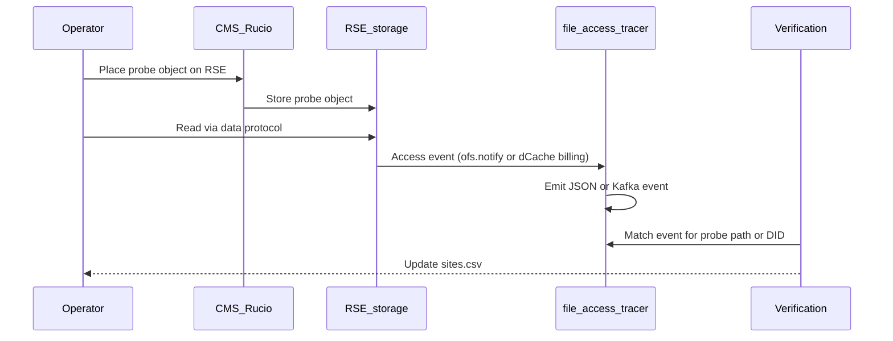

# Access-capture validation campaign

Inventory and validation status for CMS RSEs that should emit file read-access events into `file-access-tracer` (and eventually a shared Kafka topic).

## Artifacts

| Artifact | Role |
|----------|------|
| [`sites.csv`](sites.csv) | Canonical inventory used by automation |
| [`SITES.md`](SITES.md) | Human-readable status summary derived from the CSV |

Regenerate the Markdown view after editing the CSV:

```bash
python scripts/render_sites_md.py
```

Status indicators in `SITES.md`:

| Indicator | `tracer_status` |
|-----------|-----------------|
| ⚪ | `not_started` |
| 🟡 | `instrumented` |
| ✅ | `validated` |
| 🚫 | `blocked` |
| ⬛ | `out_of_scope` |

## CSV schema

| Column | Description |
|--------|-------------|
| `rse` | CMS Rucio RSE name (unique key) |
| `site` | CMS site identifier (for example `T2_CH_CERN`) |
| `tier` | Tier level when known (`0`–`3`) |
| `storage_tech` | `dCache` \| `XRootD` \| `EOS` \| `StoRM` \| `other` \| `unknown` |
| `protocol_primary` | Protocol used for the validation read (`root`, `davs`, …) |
| `endpoint_url` | Endpoint for the read protocol |
| `capture_method` | `ofs.notify` \| `dcache.kafka` \| `none` \| `deferred` \| `unknown` |
| `tracer_status` | Lifecycle status (see below) |
| `last_probe_at` | ISO-8601 timestamp of the last validation attempt |
| `last_probe_result` | `pass` \| `fail` \| `skip` \| `pending` |
| `probe_did` | Rucio DID used for the probe, if any |
| `notes` | Free-text notes |
| `contact` | Site or storage contact |

### `tracer_status`

| Status | Meaning |
|--------|---------|
| `not_started` | Listed; capture not yet configured |
| `instrumented` | Capture configured at the site |
| `validated` | Place → read → capture probe succeeded |
| `blocked` | Instrumentation not currently feasible |
| `out_of_scope` | Explicitly excluded |

## Importing RSEs from CMS Rucio

Requires a CMS VOMS proxy and a Rucio client configuration for the CMS instance:

```bash
export X509_USER_PROXY=/path/to/x509_proxy
export RUCIO_CONFIG=/path/to/rucio.cfg

python scripts/import_rses_from_rucio.py -o campaign/sites.csv
```

`storage_tech` and `capture_method` are derived heuristically from hostname and path prefixes. Correct entries manually when the heuristic is wrong. Re-import preserves existing `tracer_status`, probe results, and manually edited `storage_tech`, `capture_method`, and `notes` fields.

## Validation procedure



1. **Place** — upload a uniquely named probe object to the target RSE (or replicate one DID across RSEs).
2. **Read** — open the replica using the site data protocol (`root://` or `davs://`), not only the SRM interface.
3. **Verify** — confirm that a corresponding access event appears in tracer output or the Kafka topic within the expected latency.
4. **Record** — update `last_probe_*`, `probe_did`, and set `tracer_status` to `validated` or retain `instrumented` with a failed result.

### Expected capture by storage technology

| `storage_tech` | Expected `capture_method` | Notes |
|----------------|---------------------------|-------|
| XRootD / EOS | `ofs.notify` | Configure `ofs.notify openr` piped to `file-access-tracer`; validate with a `root://` read |
| dCache | `dcache.kafka` | Enable billing Kafka; validate with a door transfer |
| StoRM | `deferred` | Out of scope until a POSIX/WebDAV capture path is defined |

## Planned tooling

| Script | Purpose |
|--------|---------|
| `scripts/import_rses_from_rucio.py` | Import and merge RSE inventory (implemented) |
| `scripts/probe_place.py` | Upload probe objects |
| `scripts/probe_read.py` | Perform protocol reads |
| `scripts/probe_verify.py` | Match events and update `sites.csv` |
