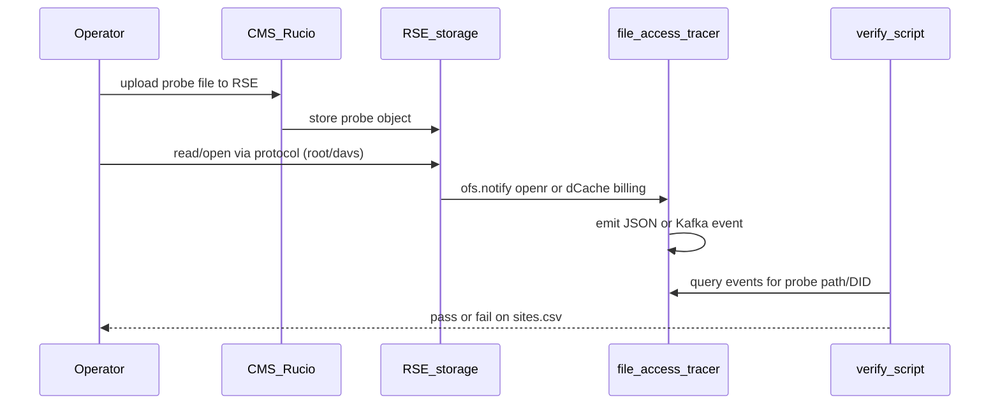

# Access-capture validation campaign

Track which CMS RSEs can report file **read** access into `file-access-tracer` / Kafka, then prove it with a place → read → verify loop.

## Inventory table

| Artifact | Role |
|----------|------|
| [`sites.csv`](sites.csv) | **Source of truth** for scripts (import, place/read/verify) |
| [`SITES.md`](SITES.md) | GitHub-friendly view with emoji status (regenerate after CSV changes) |

GitHub Markdown cannot color table rows with CSS. We use emoji + status sections in `SITES.md` instead:

| Emoji | `tracer_status` |
|-------|-----------------|
| ⚪ | `not_started` |
| 🟡 | `instrumented` |
| ✅ | `validated` |
| 🚫 | `blocked` |
| ⬛ | `out_of_scope` |

```bash
python scripts/render_sites_md.py   # CSV → SITES.md
```

Canonical columns in `sites.csv`:

| Column | Purpose |
|--------|---------|
| `rse` | CMS Rucio RSE name (unique key) |
| `site` | CMS site (e.g. `T2_CH_CERN`) |
| `tier` | 0/1/2/3 if known |
| `storage_tech` | `dCache` \| `XRootD` \| `EOS` \| `StoRM` \| `other` \| `unknown` |
| `protocol_primary` | Scheme used for the probe read (`root`, `davs`, …) |
| `endpoint_url` | Host/URL for the read protocol (fill later from Rucio protocol config) |
| `capture_method` | `ofs.notify` \| `dcache.kafka` \| `none` \| `deferred` \| `unknown` |
| `tracer_status` | Lifecycle — see below |
| `last_probe_at` | ISO timestamp of last validation attempt |
| `last_probe_result` | `pass` \| `fail` \| `skip` \| `pending` |
| `probe_did` | Rucio DID used for the probe file (if any) |
| `notes` | Free text |
| `contact` | Site / SE contact |

### `tracer_status` values

| Status | Meaning |
|--------|---------|
| `not_started` | In inventory; no instrumentation yet |
| `instrumented` | Capture configured at site (ofs.notify and/or dCache Kafka + tracer) |
| `validated` | Probe place→read→capture succeeded |
| `blocked` | Cannot instrument yet (e.g. StoRM POSIX-only) |
| `out_of_scope` | Explicitly skipped |

### Other fields we may add later

- `rse_type` (DISK/TAPE)
- `kafka_topic`
- `wlcg_monit` (already sending to MONIT via wlcgConverter?)
- `cms_site_id` / CRIC link

## Populate from CMS Rucio

Requires venv with `rucio`, a CMS VOMS proxy, and [`rucio.cfg`](../../rucio.cfg) (see workspace root).

```bash
cd /path/to/data-access-monit
source .venv/bin/activate
export X509_USER_PROXY=$PWD/x509_proxy
export RUCIO_CONFIG=$PWD/rucio.cfg
unset http_proxy https_proxy HTTP_PROXY HTTPS_PROXY

python file-access-tracer/scripts/import_rses_from_rucio.py \
  -o file-access-tracer/campaign/sites.csv
```

`storage_tech` / `capture_method` are heuristics from hostname/prefix (`pnfs`→dCache, `eos`→EOS, else often XRootD). Correct manually when wrong (e.g. some StoRM sites look like plain XRootD). Re-import preserves existing `tracer_status`, probe fields, and manual `storage_tech` / `capture_method` / `notes`.

## Validation loop (place → read → check capture)



### Steps (manual v0; automate next)

1. **Place** — upload a small unique file to each target RSE (or one DID replicated to all). Name encodes RSE + timestamp.  
2. **Read** — open/read that replica via the SE’s data protocol (`xrdcp` / davs), not only SRM.  
3. **Check** — within N seconds, confirm an access event for that path exists in tracer output / Kafka `file-access.events`.  
4. **Record** — set `last_probe_*`, `probe_did`, promote `tracer_status` → `validated` or leave `instrumented` + `fail`.

### Capture expectations by tech

| `storage_tech` | Expected `capture_method` | Probe note |
|----------------|---------------------------|------------|
| XRootD / EOS | `ofs.notify` | `ofs.notify openr \| /usr/bin/file-access-tracer`; read via `root://` |
| dCache | `dcache.kafka` | billing Kafka on; read via door |
| StoRM | `deferred` | skip until POSIX/WebDAV plan |

## Next scripts (not written yet)

- `scripts/import_rses_from_rucio.py` — fill/merge `sites.csv` from CMS Rucio  
- `scripts/probe_place.py` — upload probe file(s)  
- `scripts/probe_read.py` — read each replica  
- `scripts/probe_verify.py` — match events → update CSV  
